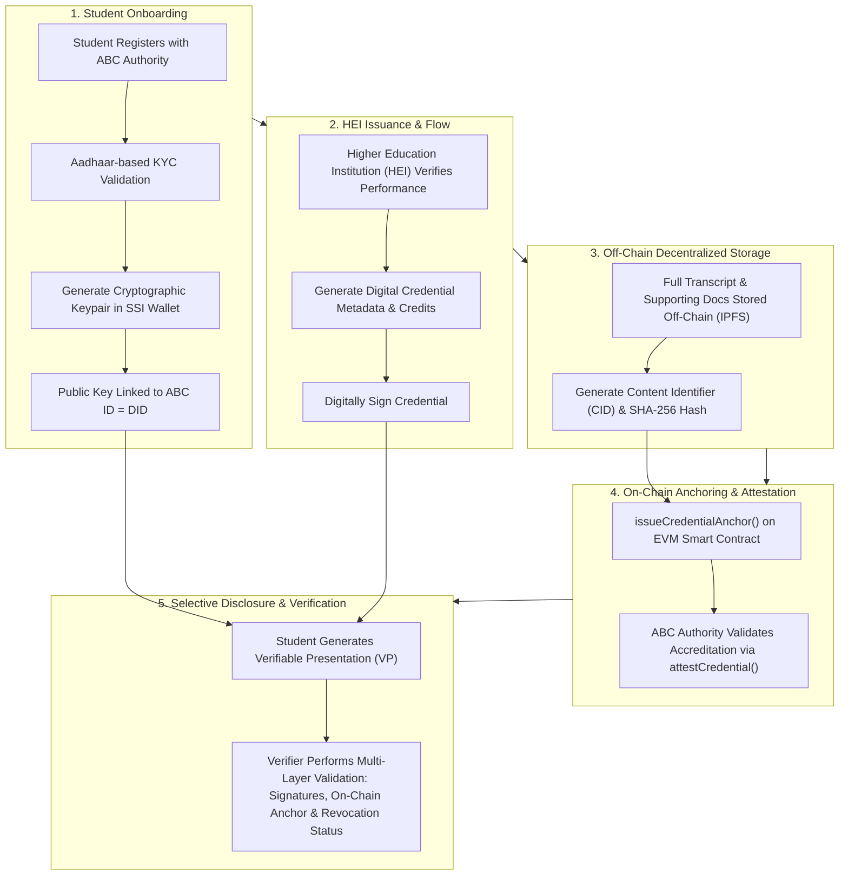

# Blockchain-Assisted Secure Academic Learning Record Management (Ba-SSI ALRM)

[](https://www.psu.edu.sa/)
[](https://doi.org/10.1109/WiDSPSU69342.2026.00036)
[]()
[-purple)]()

> **Official Repository for the Research Paper:**  
> *"Blockchain-Assisted Secure Academic Learning Record Management"*  
> Presented at **The 9th International Conference for Women in Data Science (WiDS 2026)**  
> **Prince Sultan University (PSU), Riyadh, Saudi Arabia** | September 02–03, 2026.

---

## 📌 Authors & Affiliation

* **Namrata Marium Chacko**<sup>1</sup> (`namrata.c@manipal.edu`)
* **Anvesha Singh**<sup>1</sup> (`anvesha.mitmpl2024@learner.manipal.edu`)
* **Vidya Kamath**<sup>1</sup> (`kamath.vidya@manipal.edu`)

<sup>1</sup>*Department of Computer Science & Engineering / Information Technology, Manipal Institute of Technology, Manipal Academy of Higher Education (MAHE), Manipal, Karnataka, India.*

---

## 📜 Publication Details

* **Conference:** 2026 Ninth International Women in Data Science Conference at Prince Sultan University (WiDS PSU)
* **Organizer:** Artificial Intelligence & Data Analytics (AIDA) Research Lab, Prince Sultan University
* **IEEE ISBN:** `978-8-3315-4605-2/26`
* **DOI:** [`10.1109/WiDSPSU69342.2026.00036`](https://doi.org/10.1109/WiDSPSU69342.2026.00036)
* **Pages:** 129–134

---

## 📖 Executive Summary & Motivation

Traditional Academic Learning Record Management (ALRM) systems are heavily centralized, exposing higher education ecosystems to severe vulnerabilities:
1. **Credential Fraud & Fake Degrees:** Over 50,000 fake degrees and marksheets have been sold by fraudulent rackets in India alone. Traditional physical security mechanisms (such as holographic stickers) are easily forged.
2. **Inefficient Manual Verification:** Employers and overseas verification agencies (e.g., HRD Ministry attestations) waste weeks to months performing manual verification.
3. **Single Point of Failure:** Existing e-certificate solutions rely on central Certificate Authorities (CAs). If a CA's key is compromised, all issued certificates become vulnerable.
4. **Architectural Gaps in Existing Blockchain Solutions:** Prior blockchain models suffer from high public Proof-of-Work gas costs, centralized revocation endpoints, inefficient full-artifact on-chain storage, and lack of integration with decentralized identity standards.

To solve these challenges, this paper proposes a **Blockchain-Assisted Self-Sovereign Identity (Ba-SSI)** enabled ALRM framework. The system transforms India's **Academic Bank of Credits (ABC)** into a role-governed, cryptographically verifiable academic identity infrastructure using **EVM-compatible permissioned blockchains** and **off-chain IPFS storage**.

---

## 🏗️ System Architecture & Workflow

The Ba-SSI framework decouples identity, storage, and verification layers to achieve optimal confidentiality, integrity, and scalability.



### Core Architectural Layers:
1. **Identity Layer (SSI & W3C DID):** Students retain private keys in an SSI wallet. The public key is bound to their government/academic identity (ABC ID), creating a W3C-compliant Decentralized Identifier (DID).
2. **Storage Layer (Off-Chain IPFS):** Heavy artifacts and detailed grade transcripts are stored in interplanetary file systems (IPFS). Only fixed-length cryptographic hash commitments are sent on-chain.
3. **Governance & Anchoring Layer (EVM Smart Contract):** Permissioned smart contract logic (`ALRMRegistry`) regulates credential state transitions and anchors hashes.
4. **Verification & Disclosure Layer (Verifiable Presentations):** Learners selectively disclose only required attributes to potential employers via Verifiable Presentations (VPs), preserving privacy without middleman databases.

---

## 💻 Smart Contract Specifications (`ALRMRegistry`)

The on-chain component is implemented via an Ethereum Virtual Machine (EVM) smart contract deployed on a permissioned **Kaleido** network using **Hardhat**.

### Role-Based Access Control (RBAC)
* `Owner`: Manages smart contract deployment and governance roles.
* `ISSUER_ROLE`: Granted to accredited Higher Education Institutions (HEIs) to anchor issued credentials.
* `ATTESTER_ROLE`: Reserved for regulatory bodies (e.g., ABC Authority / Ministry of Education) to endorse institutional accreditation.

### Core Interface Algorithms

| Function | Access Role | Description |
| :--- | :--- | :--- |
| `issueCredentialAnchor(credId, holderIdHash, commitment)` | `ISSUER_ROLE` | Anchors hash commitment, holder ID hash, issuer address, and issuance timestamp on-chain. |
| `attestCredential(credId)` | `ATTESTER_ROLE` | Validates regulatory compliance and updates state flag `attested = true`. |
| `revokeCredential(credId)` | `ISSUER_ROLE` / `ATTESTER_ROLE` | Updates status flag `revoked = true` without modifying immutable past transactions. |
| `verify(credId, expectedCommitment)` | Public / Verifier | Returns `(match, attested, revoked, issuer)` for instantaneous credential verification. |

#### Smart Contract Logic (Algorithm Pseudocode)

```python
class ALRMRegistry:
    def issueCredentialAnchor(credId, holderIdHash, commitment):
        require(msg.sender has ISSUER_ROLE)
        require(credId is new)
        Anchors[credId] = Struct(
            issuer=msg.sender,
            holderIdHash=holderIdHash,
            commitment=commitment,
            issuedAt=block.timestamp,
            attested=False,
            revoked=False
        )
        emit CredentialAnchored(credId, msg.sender)

    def attestCredential(credId):
        require(msg.sender has ATTESTER_ROLE)
        require(Anchors[credId] exists and not Anchors[credId].revoked)
        Anchors[credId].attested = True
        emit CredentialAttested(credId, msg.sender)

    def revokeCredential(credId):
        require(msg.sender has ISSUER_ROLE or msg.sender has ATTESTER_ROLE)
        Anchors[credId].revoked = True
        emit CredentialRevoked(credId, msg.sender)

    def verify(credId, expectedCommitment):
        if Anchors[credId] exists:
            match = (Anchors[credId].commitment == expectedCommitment)
            return (match, Anchors[credId].attested, Anchors[credId].revoked, Anchors[credId].issuer)
        return (False, False, False, None)
```

---

## 📊 Empirical Performance & Benchmark Results

Performance testing was executed on a permissioned EVM environment provisioned via **Kaleido**, utilizing Hardhat automated load generation scripts across varying concurrency levels $\{1, 5, 10, 20\}$ up to 100 transaction batches.

### 1. Gas Consumption Profile

| Operation | Average Gas Used | Cost Behavior & Variance |
| :--- | :---: | :--- |
| `issueCredentialAnchor()` | **~150,000 Gas** | Highest gas cost due to storage initialization of hash, issuer, timestamp, and event emission. |
| `revokeCredential()` | **~60,000 Gas** | Updates revocation boolean flag and emits event log. |
| `attestCredential()` | **~30,000 Gas** | Updates attestation state flag and emits event log. |

> **Key Insight:** Gas usage remains deterministic and bounded (low variance $\sigma^2_{g,op}$) regardless of actual transcript size, because only fixed 256-bit cryptographic hashes are stored on-chain.

### 2. Transaction Confirmation Latency

* **Average Confirmation Latency:** Uniform at **~4,800 ms (4.8 seconds)** across all operations.
* **Latency Driver:** Execution time is dominated by network-level block scheduling and consensus block finality on Kaleido, rather than smart contract execution complexity.

### 3. Throughput & Scalability Analysis

| Concurrency (Parallel Clients) | Throughput (TPS) | System State |
| :---: | :---: | :--- |
| **1** | ~0.20 TPS | Sequential execution baseline |
| **5** | ~0.90 TPS | Linear throughput growth |
| **10** | **~1.52 TPS (Peak)** | Maximum throughput utilization |
| **20** | ~1.50 TPS | Network saturation plateau (block space limit) |

> **Key Insight:** Parallel transaction submission increases throughput up to 10 concurrent clients (peaking at 1.52 TPS). Beyond this, throughput saturates due to block gas limits and consensus propagation delays.

---

## 📑 Comparative Analysis

The proposed Ba-SSI framework achieves superior security, privacy, and performance guarantees compared to prior art:

| Feature / Dimension | Accredible / BlockCerts | EduCTX / ABC Models | CHESICC / Docschain | **Proposed Ba-SSI ALRM** |
| :--- | :---: | :---: | :---: | :---: |
| **Blockchain Network** | Public (Bitcoin/Ethereum) | Consortium (DPoS) | Sidechain / Hybrid | **Permissioned EVM (Kaleido)** |
| **Confidentiality** | ❌ | ❌ | ✔️ | **✔️ (Encrypted Off-chain)** |
| **Authenticity & Integrity** | ✔️ | ✔️ | ✔️ | **✔️ (Digital Sig + On-chain Hash)** |
| **Privacy Protection** | ✔️ | ❌ | ✔️ | **✔️ (SSI & Selective Disclosure)** |
| **Off-Chain Artifact Storage** | ❌ (On-chain / QR) | ❌ | ✔️ | **✔️ (IPFS Content CIDs)** |
| **Formal Cost & Latency Analysis**| ❌ | ❌ | ❌ | **✔️ (Empirical Hardhat Benchmarks)** |
| **Scalability Analysis** | ❌ | ❌ | ❌ | **✔️ (Evaluated up to 20 Concurrency)** |

---

## 🛠️ Technical Constraints & Mitigation Strategies

| Constraint | Impact on System | Proposed Mitigation Strategy |
| :--- | :--- | :--- |
| **Scalability & Gas Cost** | Public EVMs exhibit gas volatility and low TPS. | Deploy on permissioned networks (PoA), implement Layer-2 rollups, and limit on-chain data to hashes. |
| **Identity Infrastructure Maturity** | Native W3C VC/DID stack integration in progress. | Future integration with SSI mobile wallets and Zero-Knowledge Proof (ZKP) verification. |
| **Immutability vs. Revocation** | Ledger immutability prevents deleting invalid credentials. | Status-based revocation flags (`revoked = true`) without mutating original historical transactions. |
| **Data Privacy (GDPR/Compliance)** | Public ledger data visibility creates leakage risk. | Off-chain storage of personal data on IPFS with encryption; on-chain storage limited to anonymous hashes. |
| **Cross-Platform Interoperability** | Multi-chain environments require standardized models. | Standard adoption of W3C DID/VC and benchmarking across Hyperledger Fabric and R3 Corda. |

---

## 📂 Repository Contents

```
Blockchain_Project/
├── README.md                                         # Comprehensive repository documentation
├── Blockchain paper.pdf                              # Full IEEE accepted paper (WiDS 2026)
└── WiDS 2026 Certificate CERTIFICATE OF ACCEPTANCE 55.pdf  # Official Acceptance Certificate
```

### Document Verification Details:
1. **`Blockchain paper.pdf`**  
   * Full 6-page research paper complete with system diagrams (Fig. 1), performance benchmark charts (Fig. 2), comparative evaluation tables (Tables I & II), technical mitigation strategies (Table III), and 29 references.
2. **`WiDS 2026 Certificate CERTIFICATE OF ACCEPTANCE 55.pdf`**  
   * Official acceptance certificate issued by Prince Sultan University (Riyadh, Saudi Arabia), signed by **Dr. Heba Khoshaim** (Executive Chair WiDS Riyadh) and **Dr. Tanzila Saba** (Leader, AIDA Research Lab & WiDS Ambassador).

---

## ✒️ Citation

If you use this work or reference the framework in your research, please cite:

```bibtex
@inproceedings{chacko2026blockchain,
  author    = {Chacko, Namrata Marium and Singh, Anvesha and Kamath, Vidya},
  title     = {Blockchain-Assisted Secure Academic Learning Record Management},
  booktitle = {Proceedings of the 2026 Ninth International Women in Data Science Conference at Prince Sultan University (WiDS PSU)},
  pages     = {129--134},
  year      = {2026},
  publisher = {IEEE},
  isbn      = {978-8-3315-4605-2/26},
  doi       = {10.1109/WiDSPSU69342.2026.00036}
}
```

---
*Maintained by the authors at Manipal Institute of Technology, MAHE, Manipal.*
